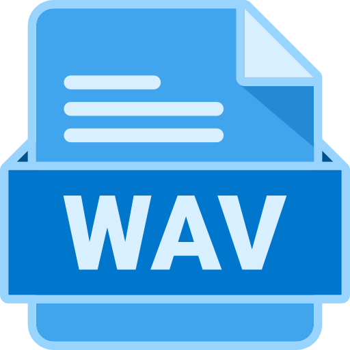
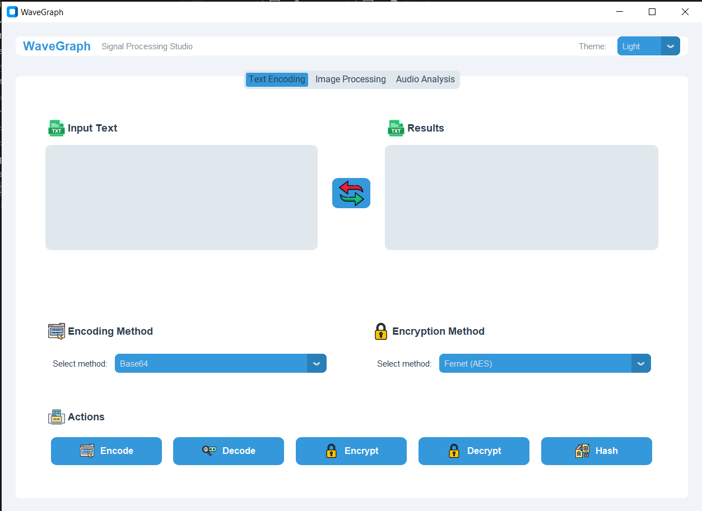
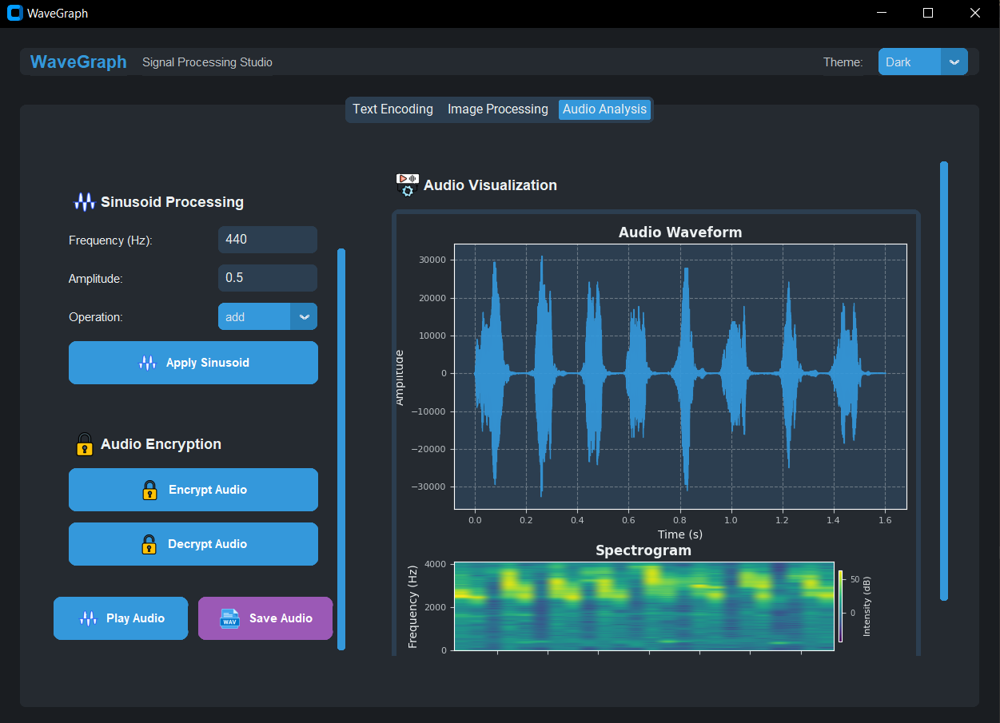

# 🌊 WaveGraph

<div align="center">
  
  <h3>Studio Pemrosesan Sinyal Modern</h3>
  <p>Aplikasi desktop yang kuat untuk pengolahan teks, gambar, dan audio dengan antarmuka yang elegan</p>
  
  
  
  
</div>

## 📋 Daftar Isi
- [✨ Fitur Utama](#-fitur-utama)
- [🖼️ Tampilan](#-tampilan)
- [🚀 Memulai](#-memulai)
- [🔧 Instalasi](#-instalasi)
- [🔍 Penggunaan](#-penggunaan)
- [🧩 Struktur Proyek](#-struktur-proyek)
- [📚 Teknologi](#-teknologi)
- [🤝 Kontribusi](#-kontribusi)
- [📄 Lisensi](#-lisensi)

## ✨ Fitur Utama

WaveGraph adalah aplikasi desktop all-in-one untuk pemrosesan sinyal dengan tiga modul utama:

### 🔤 Pengkodean Teks
- **Enkode & Dekode**: Dukungan untuk Base64, Hex, Unicode, dan ASCII
- **Enkripsi & Dekripsi**: Metode Fernet (AES), XOR, dan Caesar Cipher
- **Hashing**: Fungsi hash SHA-256
- **Antarmuka Intuitif**: Tombol swap untuk menukar konten input dan output

### 🖼️ Pemrosesan Gambar
- **Steganografi**: Sembunyikan dan ekstrak pesan rahasia dalam gambar
- **Pratinjau Gambar**: Visualisasi real-time dari gambar yang diproses
- **Penyimpanan Aman**: Simpan gambar dengan pesan tersembunyi

### 🎵 Analisis Audio
- **Visualisasi Gelombang**: Tampilan grafis dari bentuk gelombang audio
- **Pemrosesan Sinusoid**: Tambah, kurang, atau kalikan sinyal audio dengan gelombang sinus
- **Enkripsi Audio**: Enkripsi dan dekripsi file audio menggunakan algoritma Fernet dan Delta
- **Pemutaran Audio**: Putar file audio langsung dari aplikasi
- **Penyimpanan Audio**: Simpan file audio yang telah diproses

### 🎨 Fitur Tambahan
- **Mode Tema**: Dukungan untuk mode terang dan gelap
- **Antarmuka Modern**: Desain UI yang bersih dan responsif dengan CustomTkinter
- **Panel Scrollable**: Navigasi mudah bahkan dengan ukuran jendela terbatas

## 🖼️ Tampilan

<div align="center">
  <p><i>Gambar tampilan aplikasi akan ditampilkan di sini</i></p>
  
  
</div>

## 🚀 Memulai

### Prasyarat
- Python 3.8 atau lebih baru
- Pip (pengelola paket Python)

## 🔧 Instalasi

1. **Klon repositori ini**
   ```bash
   git clone https://github.com/username/WavGraph.git
   cd WavGraph
   ```

2. **Buat lingkungan virtual Python**
   ```bash
   python -m venv .venv
   ```

3. **Aktifkan lingkungan virtual**
   - Windows:
     ```bash
     .\.venv\Scripts\activate
     ```
   - Linux/macOS:
     ```bash
     source .venv/bin/activate
     ```

4. **Instal dependensi**
   ```bash
   pip install -r requirements.txt
   ```

5. **Jalankan aplikasi**
   ```bash
   python app.py
   ```

## 🔍 Penggunaan

### Tab Pengkodean Teks
1. Masukkan teks di area input
2. Pilih metode pengkodean (Base64, Hex, Unicode, ASCII)
3. Pilih metode enkripsi jika diperlukan (Fernet, XOR, Caesar)
4. Klik tombol aksi (Encode, Decode, Encrypt, Decrypt, Hash)
5. Gunakan tombol swap untuk menukar konten input dan output

### Tab Pemrosesan Gambar
1. Klik "Select Image" untuk memilih gambar
2. Masukkan pesan rahasia di area teks
3. Klik "Encode Message" untuk menyembunyikan pesan dalam gambar
4. Klik "Decode Message" untuk mengekstrak pesan dari gambar
5. Klik "Save Image" untuk menyimpan gambar yang telah diproses

### Tab Analisis Audio
1. Klik "Select Audio File" untuk memilih file audio WAV
2. Gunakan opsi pemrosesan sinusoid untuk memodifikasi audio
3. Gunakan opsi enkripsi untuk mengenkripsi atau mendekripsi audio
4. Klik "Play Audio" untuk mendengarkan audio
5. Klik "Save Audio" untuk menyimpan file audio yang telah diproses

## 🧩 Struktur Proyek

```
WavGraph/
├── app.py                 # File utama aplikasi
├── requirements.txt       # Dependensi proyek
├── assets/                # Aset gambar dan ikon
│   ├── first_tab/         # Ikon untuk tab pengkodean teks
│   ├── second_tab/        # Ikon untuk tab pemrosesan gambar
│   └── third_tab/         # Ikon untuk tab analisis audio
└── pages/                 # Modul halaman aplikasi
    ├── firstPage.py       # Implementasi tab pengkodean teks
    ├── secondPage.py      # Implementasi tab pemrosesan gambar
    └── thirdPage.py       # Implementasi tab analisis audio
```

## 📚 Teknologi

WaveGraph dibangun dengan teknologi modern:

- **Python**: Bahasa pemrograman utama
- **CustomTkinter**: Framework UI modern berbasis Tkinter
- **NumPy**: Pemrosesan array dan matematika
- **Matplotlib**: Visualisasi data dan bentuk gelombang
- **Pillow (PIL)**: Pemrosesan gambar
- **Cryptography**: Enkripsi dan dekripsi data
- **Wave**: Pemrosesan file audio

## 🤝 Kontribusi

Kontribusi selalu disambut! Jika Anda ingin berkontribusi:

1. Fork repositori
2. Buat branch fitur (`git checkout -b fitur-keren`)
3. Commit perubahan Anda (`git commit -m 'Menambahkan fitur keren'`)
4. Push ke branch (`git push origin fitur-keren`)
5. Buka Pull Request

## 📄 Lisensi

Proyek ini dilisensikan di bawah Lisensi MIT - lihat file LICENSE untuk detail.

---